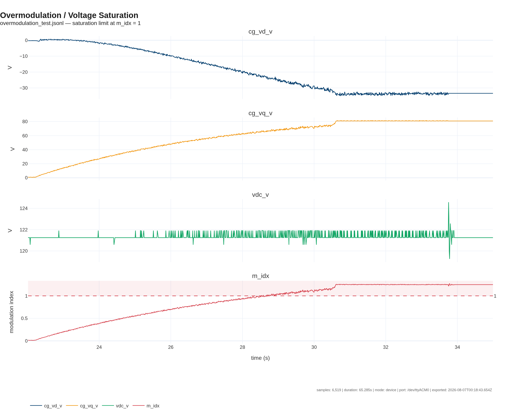
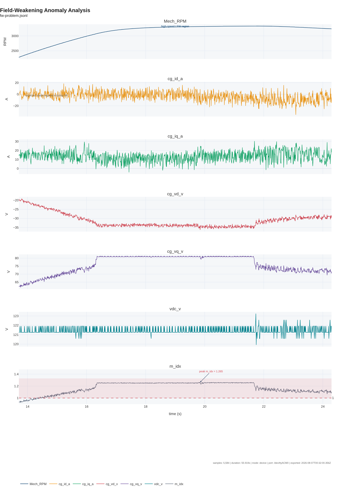

# rteplot — RTE telemetry plotting tool

A small, extensible Plotly-based CLI for turning RTE `.jsonl` telemetry logs into
publication-ready figures. Built for quickly showing control problems to
professors / industry partners, and easy to extend for new log formats and new
diagnostic views.

## Installation

The tool lives in its own folder and uses the project venv:

```bash
# from repo root
.venv/bin/pip install plotly pandas kaleido Pillow
```

(Already done in this repo.)

## Quick start

```bash
cd Tools/rteplot

# See what is in a log
../../.venv/bin/python rteplot.py info ../../overmodulation_test.jsonl

# List available recipes
../../.venv/bin/python rteplot.py recipes

# Render a built-in recipe to PNG (retina scale by default)
../../.venv/bin/python rteplot.py plot ../../overmodulation_test.jsonl \
    --recipe overmodulation -o overmodulation.png

# Interactive HTML
../../.venv/bin/python rteplot.py plot ../../fw-problem.jsonl \
    --recipe fieldweakening -o fw.html

# Zoom in on the problem and add a logo
../../.venv/bin/python rteplot.py plot ../../fw-problem.jsonl \
    --recipe fieldweakening -o fw_zoom.png \
    --t0 5 --t1 35 --logo assets/logo.png
```

## Recipes

| Recipe           | What it shows                                                              |
|------------------|----------------------------------------------------------------------------|
| `overmodulation` | `vd`, `vq`, `vdc`, and computed modulation index with saturation limit     |
| `fieldweakening` | Speed, `id`/`iq`, voltages, and modulation index                           |
| `fwanalysis`     | Diagnostic field-weakening view with shaded anomaly regions                |
| `currents`       | Phase and d/q currents                                                     |
| `voltages`       | Phase, d/q, and DC-link voltages                                           |

Recipes automatically fall back between common signal names (`cg_id_a`,
`mpcc_id_a`, `Mech_RPM`, `RPM`, `mpcc_omega_e`, etc.) so they work across
controller variants.

## Example outputs

### Overmodulation / voltage saturation

`overmodulation_test.jsonl`, zoomed to the transition where the modulation index
crosses 1:



### Field-weakening problem

`fw-problem.jsonl`, auto-cropped to the worst anomaly window:



## Automatic anomaly detection

```bash
# Print a concise anomaly report
../../.venv/bin/python rteplot.py anomalies ../../fw-problem.jsonl

# Report + auto-render the worst anomaly window
../../.venv/bin/python rteplot.py anomalies ../../fw-problem.jsonl \
    -p fw_problem.png --recipe fwanalysis

# Auto-crop any recipe to the worst anomaly
../../.venv/bin/python rteplot.py plot ../../fw-problem.jsonl \
    --recipe fwanalysis --auto-window -o fw_auto.png
```

Detected anomaly types: `overmodulation`, `voltage_saturation`,
`id_oscillation`, `iq_oscillation`, `fw_id_positive`.

## CLI options

```
rteplot plot LOG --recipe NAME [-o OUTPUT] [options]

  --recipe, -r          recipe name (required)
  --output, -o          output file; extension selects format
                        (.png, .pdf, .svg, .jpg, .html)
  --t0, --t1            crop to a time window in seconds
  --auto-window         auto-crop to the worst anomaly (ignores --t0/--t1)
  --max-points          downsample raster outputs (default 5000)
  --width               figure width in px (default 1280)
  --height-per-row      subplot row height in px (default 260)
  --scale               raster export scale, default 2 (retina)
  --logo                path to logo image
  --logo-scale          logo size as fraction of figure width (default 0.18)
  --no-legend           hide the legend
```

## Adding a logo

1. Drop an image at `Tools/rteplot/assets/logo.png` (transparent PNG works
   best), or pass `--logo path/to/logo.png`.
2. The logo appears in the top-right corner of every figure.

See `assets/README.md` for details.

## Adding a new recipe

Create `Tools/rteplot/recipes/myproblem.py` with:

```python
from __future__ import annotations
import rteplot_lib as core
from rteplot_lib import PlotConfig, SessionMeta

TITLE = "My Problem"
DESCRIPTION = "One-line explanation."


def make_fig(df, meta: SessionMeta, cfg: PlotConfig):
    signals = core.pick_signals(df, [
        ["Mech_RPM", "Elec_RPM", "RPM"],
        ["cg_id_a", "mpcc_id_a"],
    ])
    fig = core.make_subplot_fig(
        df=df, signals=signals, meta=meta, cfg=cfg,
        title=TITLE, subtitle=meta.source.name,
    )
    return fig
```

It will show up automatically in `rteplot recipes`.

## For LLM agents / future me

If you are an LLM reading this, here is the shortest useful workflow:

1. **Inspect the log**: `rteplot.py info LOG.jsonl` gives signal list, duration,
   and sample count.
2. **Pick a recipe**: `rteplot.py recipes` lists options. Use `fwanalysis` for
   field-weakening issues, `overmodulation` for voltage saturation.
3. **Detect anomalies first**: `rteplot.py anomalies LOG.jsonl` reports problem
   intervals with severity and time ranges.
4. **Render the problem**: use `rteplot.py anomalies LOG.jsonl -p out.png` or
   `rteplot.py plot LOG.jsonl --recipe RECIPE --auto-window -o out.png`.
5. **Custom window**: if the auto-window misses the interesting part, use
   `--t0 T0 --t1 T1` based on the anomaly report.

Key failure signatures to flag:

| Symptom                         | Signals to check                              | Bad sign                                  |
|---------------------------------|-----------------------------------------------|-------------------------------------------|
| Overmodulation                  | `m_idx` (computed), `cg_vd_v`, `cg_vq_v`      | `m_idx > 1` sustained                     |
| Voltage saturation              | `cg_vq_v`, `vdc_v`                            | `vq` flat at a ceiling                    |
| Field-weakening current broken  | `Mech_RPM`, `cg_id_a`                         | high RPM but `id` noisy or positive       |
| Current oscillation / noise     | `cg_id_a`, `cg_iq_a`                          | large rolling std or high-frequency noise |

When in doubt, run `fwanalysis` with `--auto-window` and look at the shaded
regions.

## Tips

- Use `.html` output when you want to pan/zoom interactively; use `.png`/`.pdf`
  for slides or papers.
- `--max-points` only affects static raster exports. Interactive HTML keeps all
  telemetry points so you can zoom without losing data.
- For long logs, crop with `--t0`/`--t1` rather than relying on full-file
  downsample — the time window is applied before plotting.
